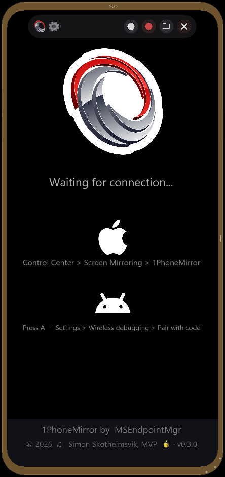
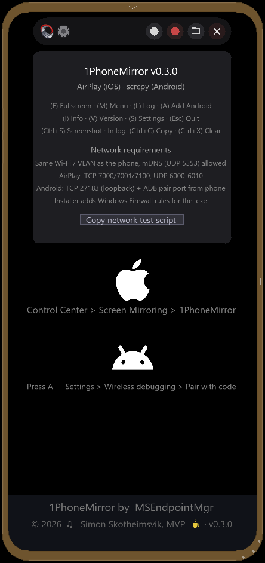
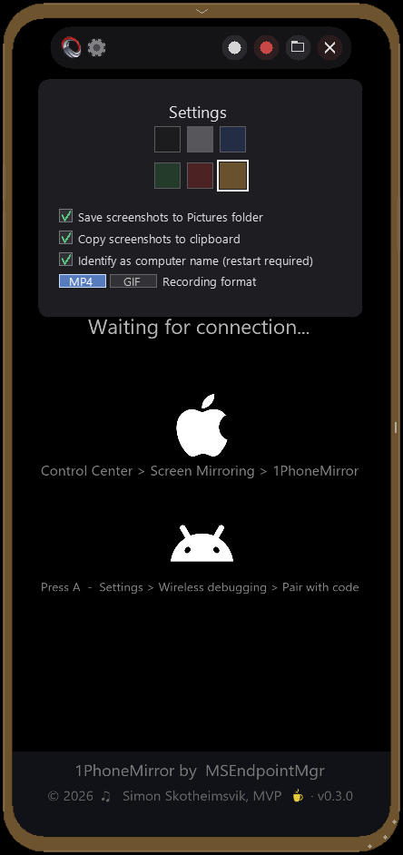
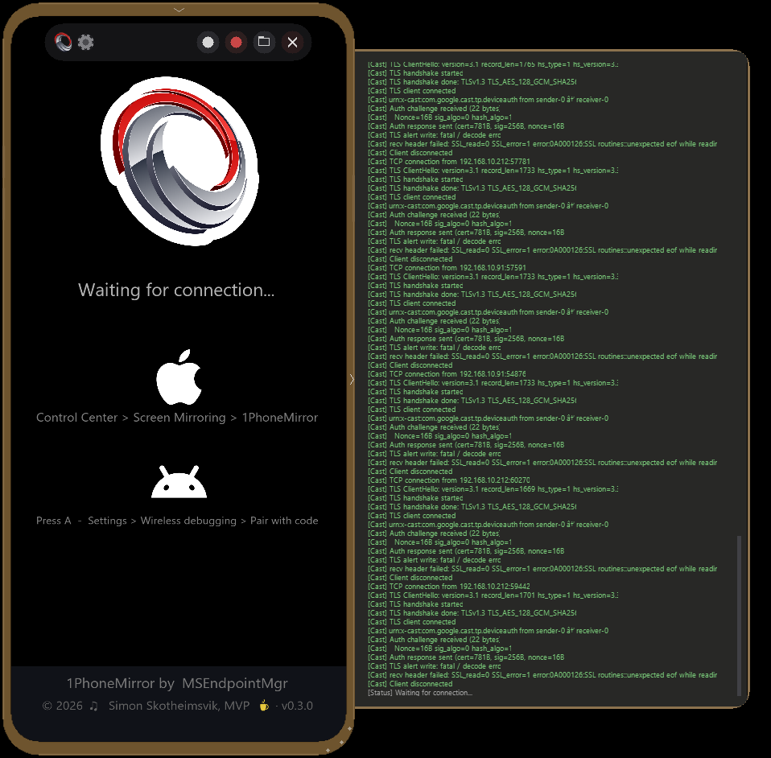

# 1PhoneMirror

An open-source screen-mirroring receiver for Windows that lets an iPhone or
an Android phone show up inside a phone-shaped window on your PC — no app
installed on the phone, no cables.

- **iOS / iPadOS / macOS** — native AirPlay (Screen Mirroring), with optional PIN pairing.
- **Android** — Wireless Debugging via the bundled `adb` + `scrcpy-server.jar`.
- **Miracast** — Wi-Fi Direct receiver (experimental, Windows-only).
- **Capture** — one-click screenshots (PNG) and screen recording (MP4 or GIF) straight into a phone-framed picture or clip — perfect for documentation.

Multiple phones can stay paired at once and appear as small dots in the
bottom bezel; left-click switches the active source, right-click opens a
menu to disconnect.

> Like the project? [Buy me a coffee ☕](https://buymeacoffee.com/simonskothn) — every tip helps keep development going.

## Why 1PhoneMirror exists

I build documentation and deliver training on managing Android and iOS
devices through Microsoft Intune. Every walkthrough needs clean
screenshots of the phone — ideally framed in a real device shape so
readers immediately know what they're looking at.

Finding a tool that did just that turned out to be surprisingly painful:
the free options either didn't work reliably, locked the good features
behind a subscription, or produced bare un-framed captures I had to
re-edit by hand. So I wrote my own. **1PhoneMirror** is the result —
a no-install, no-cable mirror that drops a properly-framed phone image
straight into your screenshots and recordings, ready to paste into a
guide, a Loop page, or a slide deck.
## Screenshots

<table>
  <tr>
    <td align="center"></td>
    <td align="center"></td>
  </tr>
  <tr>
    <td><b>Idle screen</b> — quick reminders for AirPlay (iOS) and Wireless debugging (Android), with the framed phone window ready to receive.</td>
    <td><b>Info panel</b> (<code>I</code>) — version, shortcuts, network requirements, and a one-click "Copy network test script" for IT validation.</td>
  </tr>
  <tr>
    <td align="center"></td>
    <td align="center"></td>
  </tr>
  <tr>
    <td><b>Settings panel</b> (<code>S</code>) — bezel colour swatches, screenshot/clipboard toggles, computer-name identity, and the MP4 / GIF recording-format selector.</td>
    <td><b>Log viewer</b> (<code>L</code>) — live activity drawer slides out to the right, perfect for debugging AirPlay handshakes or Android pairing.</td>
  </tr>
</table>

## Architecture

The receiver runs entirely on the PC. AirPlay (iOS) and scrcpy (Android)
streams are decoded with FFmpeg and rendered through SDL2 inside the
phone-shaped window. Recording captures the same RGBA frames straight
into MP4 (libx264) or animated GIF.

## Install

The fastest way (Windows 10 / 11):

```powershell
winget install MSEndpointMgr.1PhoneMirror
```

Already installed? Upgrade to the latest release with:

```powershell
winget upgrade MSEndpointMgr.1PhoneMirror
```

Or grab the latest MSI directly from
[Releases](https://github.com/MSEndpointMgr/1PhoneMirror/releases/latest).

## Connecting a phone

### iPhone / iPad / Mac (AirPlay)
1. PC and phone on the **same Wi-Fi**.
2. Phone: **Control Center → Screen Mirroring → 1PhoneMirror**.
3. If PIN pairing is enabled, type the PIN shown on the PC.

### Android (Wireless Debugging)
1. Phone: **Settings → Developer options → Wireless debugging** → enable.
2. Tap **Pair device with pairing code** — note the **IP : port** and **6-digit code**.
3. PC: in 1PhoneMirror press **A** — the dialog pre-fills your PC's `/24`
   subnet (e.g. `192.168.0.`); type the phone's last octet, the pair port,
   and the PIN, then **Connect**. The phone shows up via mDNS within a
   second or two and starts mirroring.

A new pairing code is required each time the pair-with-code screen is
opened. Once paired, the device serial sticks until you forget it on
the phone.

### Miracast (Android, experimental)
1. PC: leave Miracast enabled (default).
2. Phone: **Quick Settings → Cast / Smart View / Screen Cast** → pick the PC.

## Capture

| Output | How |
|--------|-----|
| **Screenshot (PNG)** | `Ctrl+S`, or click the white circle in the menu/bezel. Saved to `Pictures\1PhoneMirror\` and/or copied to clipboard (toggle in Settings). |
| **Video (MP4)** | `Ctrl+R`, or click the red circle in the menu/bezel. H.264 via libx264, 30 fps by default. |
| **Animated GIF** | Switch format in Settings → record as above. Auto-downscaled to 480 px wide. |
| **Delayed recording** | Right-click the record button → **Start in 5 s**. Frosty countdown overlays the screen. |
| **Timed clip** | Right-click → **Record 5 s / 10 s / 15 s** — auto-stops at the chosen duration. |

All output lands in your `Pictures\1PhoneMirror\` folder; click the folder
button on the menu (or use the Windows file dialog) to open it.

## Keyboard shortcuts

| Key | Action |
|-----|--------|
| `F` | Toggle fullscreen |
| `M` | Toggle island menu |
| `L` | Toggle log viewer |
| `A` | Open Android pair / connect dialog |
| `I` | Toggle info panel |
| `V` | Toggle version history |
| `S` | Toggle settings panel (bezel colour, screenshots, recording format) |
| `Ctrl+S` | Screenshot — save to Pictures folder and/or clipboard (per Settings) |
| `Ctrl+R` | Start / stop screen recording (MP4 or GIF, per Settings) |
| `Ctrl+C` | (Log viewer) Copy entire log to clipboard |
| `Ctrl+X` | (Log viewer) Clear log |
| `Esc` | Close panel / quit |

## Version history

| Version | Date | Highlights |
|---------|------|------------|
| **0.3.7** | 15.05.2026 | **OCR text capture** (`Ctrl+Shift+T`): right-click any region of the mirrored phone screen to copy the recognised text straight to the Windows clipboard. Powered by `Windows.Media.Ocr`. |
| **0.3.6** | 14.05.2026 | **Screenshot annotation** (`Ctrl+Shift+S`): arrow, rectangle, highlight, pixelate and text tools, 5-colour palette, line-width slider, undo, save (PNG + clipboard). |
| **0.3.5** | 13.05.2026 | Version check and UI tunings. In-app GitHub update check, Info panel "About" section, polished footer typography. |
| **0.3.4** | 13.05.2026 | New Android discovery routine for easy connect. |
| **0.3.3** | 12.05.2026 | Right-click the resize grip to reset the window to its default size. |
| **0.3.2** | 11.05.2026 | User interface fixes. |
| **0.3.1** | 10.05.2026 | **Phone frame on recordings** — MP4 and GIF now include the phone bezel/rounded corners just like screenshots. GIF gets per-frame optimal palette via `palettegen`+`paletteuse` with **genuine transparent rounded corners**. |
| **0.3.0** | 10.05.2026 | **Screen recording** — MP4 (H.264) and GIF, `Ctrl+R`, right-click for 5 s delay or 5 / 10 / 15 s timed clips. Frosty countdown overlay, REC chip while recording. Format selector in Settings. New bezel record button alongside the screenshot button. |
| **0.2.5** | 09.05.2026 | Info panel: copy network-test PowerShell script (with MDM check). |
| **0.2.4** | 08.05.2026 | Refined bezel toggles and auto-collapse on connect. |
| **0.2.3** | 08.05.2026 | Better Android experience and quicker screenshots. |
| **0.2.2** | 08.05.2026 | Settings: identify as computer name on the network. Bezel device dots show play/pause icon per source. |
| **0.2.1** | 07.05.2026 | Settings panel (`S`): bezel colour + screenshot options. |
| **0.2.0** | 06.05.2026 | Android mirroring (Wireless debugging, press `A`). |
| **0.1.6** | 06.05.2026 | Multiple iOS devices stay paired — switch from bezel dots. |
| **0.1.5** | 06.05.2026 | AirPlay PIN pairing for trusted-device security. |
| **0.1.4** | 06.05.2026 | Slide-out log viewer with live filtering (press `L`). |
| **0.1.2** | 05.05.2026 | Dynamic island menu in top bezel for quick actions. |
| **0.1.1** | 05.05.2026 | Screenshot capture to clipboard and Pictures folder. |
| **0.1.0** | 05.05.2026 | iOS AirPlay support. |
| **0.0.5** | 04.05.2026 | Initial ideas and implementation. |

The full version log is also available in-app — press `V`.

## Known app quirks

A few iOS apps interact with AirPlay in unusual ways. These are app-side
behaviours, not 1PhoneMirror bugs, but they're worth knowing about:

- **TripIt** — when launched, allocates a separate landscape `1920×1080`
  AirPlay surface and routes that to the receiver instead of mirroring
  the on-phone view. The result is a small "second-monitor" canvas that
  doesn't match what you see on the phone and isn't interactive.
  1PhoneMirror keeps the phone frame stable across this canvas switch
  (no auto-rotate to landscape) and letterboxes the surface inside the
  phone screen rect, but the content is whatever TripIt chose to send.

If you spot another app that misbehaves, please open an issue with a
screenshot and the relevant lines from the in-app log (`L`).

## Project status

| Component | State |
|-----------|-------|
| AirPlay 2 — RTSP + mDNS + FairPlay + multi-source | Working |
| AirPlay PIN pairing | Working |
| Android — ADB pair/connect + scrcpy v3 stream | Working |
| Screenshots (PNG) | Working |
| Screen recording (MP4 H.264, GIF) | Working |
| Miracast — WinRT receiver | Experimental |
| Hardware-accelerated decode (DXVA2 / D3D11VA) | Planned |
| System tray + autostart | Planned |
| Touch input forwarding (Miracast UIBC) | Planned |

## References

| Resource | What it provides |
|----------|------------------|
| [UxPlay](https://github.com/antimof/UxPlay) | AirPlay 2 receiver — FairPlay crypto, stream handling |
| [RPiPlay](https://github.com/FD-/RPiPlay) | Simpler AirPlay receiver — good FairPlay reference |
| [scrcpy](https://github.com/Genymobile/scrcpy) | The server-side JAR pushed to Android devices |
| [Windows.Media.Miracast](https://learn.microsoft.com/en-us/uwp/api/windows.media.miracast) | WinRT Miracast API docs |
| [Bonjour SDK](https://developer.apple.com/bonjour/) | DNS-SD for AirPlay discovery on Windows |

## Support the project

If 1PhoneMirror saves you time on Intune docs, training, or just casual
demos, consider tipping a coffee — it directly funds new features and
keeps the project free for everyone.

[](https://buymeacoffee.com/simonskothn)

## License

1PhoneMirror is licensed under **GPL-3.0** — see [LICENSE](LICENSE).

### Third-party components

The Windows installer bundles the following components, each under its own
license:

| Component | Version | License | Role |
|-----------|---------|---------|------|
| [FFmpeg](https://ffmpeg.org/) | vcpkg `gpl,x264` build | GPL-2.0+ (compatible with GPL-3.0) | H.264 / AAC decoding + recording (dynamic link) |
| [libx264](https://www.videolan.org/developers/x264.html) | bundled with FFmpeg | GPL-2.0+ | H.264 encoder for MP4 recording |
| [SDL2](https://www.libsdl.org/) | vcpkg | zlib | Window, input, rendering |
| [OpenSSL](https://www.openssl.org/) | 3.x | Apache-2.0 | TLS for AirPlay handshake |
| [scrcpy-server.jar](https://github.com/Genymobile/scrcpy) | 3.0 | Apache-2.0 | Pushed to Android device, runs there |
| [adb.exe](https://developer.android.com/tools/adb) | Android Platform Tools | Apache-2.0 + AOSP | Pair / connect to Android over Wi-Fi |
| [stb_image](https://github.com/nothings/stb) | header-only | MIT / Public Domain | PNG / JPG decode for the app icon |
| Microsoft VC++ Runtime | 14.x | Microsoft Redistributable License | C/C++ runtime DLLs |

All components are GPL-3.0 compatible.

## Project metadata

A quick reference for sponsors, packagers, and code-signing programs
(SignPath OSS, sigstore, etc.).

| Field | Value |
|-------|-------|
| **Project name** | 1PhoneMirror |
| **Project URL** | https://github.com/MSEndpointMgr/1PhoneMirror |
| **Releases** | https://github.com/MSEndpointMgr/1PhoneMirror/releases |
| **Issue tracker** | https://github.com/MSEndpointMgr/1PhoneMirror/issues |
| **License** | [GPL-3.0-or-later](LICENSE) (OSI-approved) |
| **Programming language** | C++20 |
| **Target platform** | Windows 10 1903+, Windows 11 (x64) |
| **Maintainer** | Simon Skotheimsvik — Microsoft MVP, MSEndpointMgr |
| **Maintainer profile** | https://linktr.ee/simonskotheimsvik |
| **Organisation** | [MSEndpointMgr](https://github.com/MSEndpointMgr) |
| **Distribution** | MSI installer (WiX 5), published via GitHub Releases and the [winget package `MSEndpointMgr.1PhoneMirror`](https://github.com/microsoft/winget-pkgs/tree/master/manifests/m/MSEndpointMgr/1PhoneMirror) |
| **Artifact name pattern** | `1PhoneMirror-<version>.msi` |
| **Build pipeline** | GitHub Actions workflow `release.yml` — triggers on tag push `v*`, runs on `windows-latest`, produces the signed-ready MSI as a release asset |
| **Reproducible builds** | Yes — vcpkg manifest pins all dependencies (FFmpeg `gpl,x264`, SDL2, OpenSSL); the workflow uses the exact toolchain |
| **Funding** | https://buymeacoffee.com/simonskothn |

